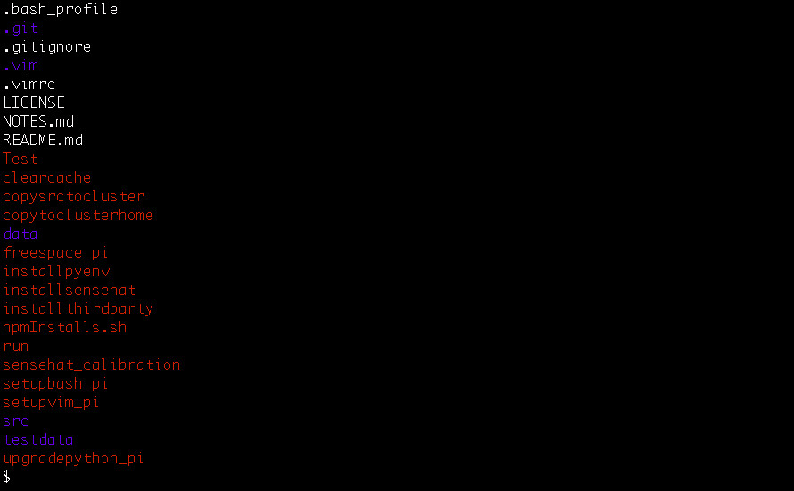

# [Machine Setup Program]()
This is a collection of simple scripts.



## Purpose/Goal
To maintain a consistency across all workstations and devices with my preferred settings.  
To protect all of my personal data and portfolio work with backups.

## Operation
```bash
# In the program's root dir, run an executable with `./executable`. Example,

$ ./scriptName
```

## Tech/Libraries Used
* one
* two

## Problems/Solutions
N/A

## What I learned  
* Basic bash scripting
* Double checking file existence before copying/moving files around
* The importance of regulary backing up files
* How to use shutil and os modules for adding, removing, copying files and dirs.

## More Information
This program:
  * Copies files over ssh, from the src machine's $HOME
  * Replaces `.vimrc` and `.bash_profile` in $HOME
  * Recursively copies `.vim/` to $HOME
